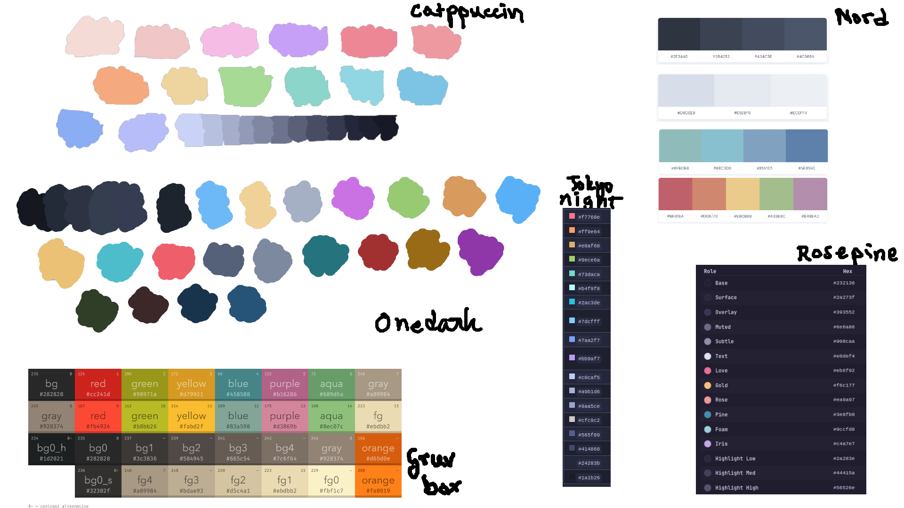
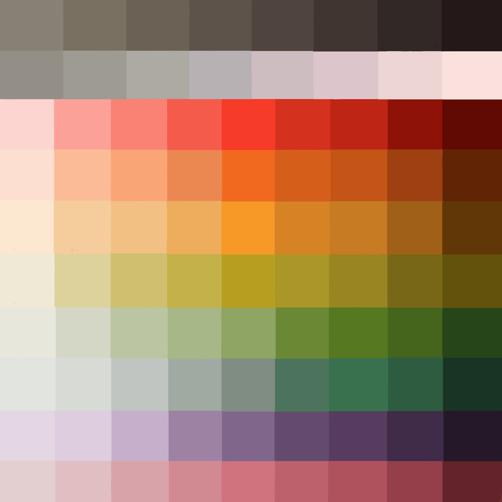
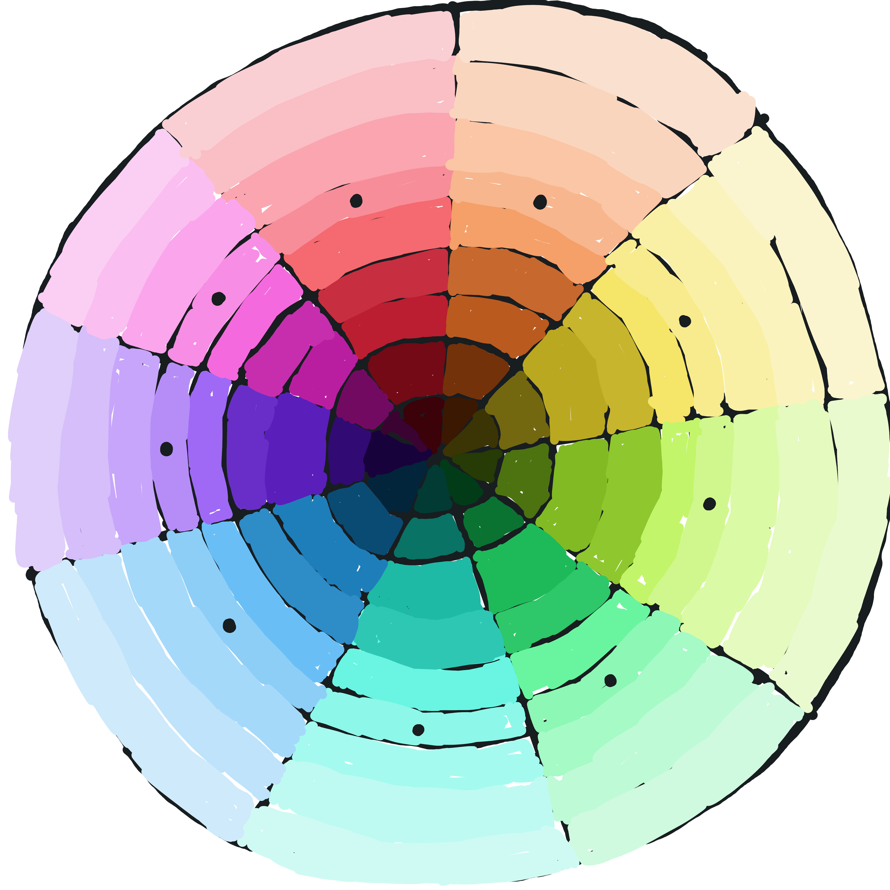

# AXLOR - Color Palette/Scheme

### TL;DR
Axlor is a color palette/scheme made out of vibrant, soft and pastel-y 
colors based on some of my favourite color schemes.

### Inspiration
The colors are inspired mostly by Catppuccin Macchiato and Atom Onedark (or 
atleast navarasu's version for neovim). I also looked into some of my other 
favourites like Gruvbox, Nord, Tokyo Night and Rosepine for inspiration.

### Why
I really like a couple of themes specially Catppuccin Macchiato and Atom 
Onedark but Macchiato can be a little bit to faded sometimes and Onedark can 
feel boring after a while. So I decided to try and make a colourscheme 
myself to experience what goes into making a colorscheme and maybe create 
something half decent which is personalised to my taste.

### Possible Improvements
* The neutral tone scale (grayscale) can benefit with a decrease in 
saturation
* The higher value shades of a color can look better with a warmer tone and 
the lower value shades with cooler
* Some colors can use a little bit of tweaking especially the warmer colors
* Some shades of a color are maybe too similar?

### Ports
* Neovim ~ Planned
* Bash Prompt ~ Planned

### Palette

